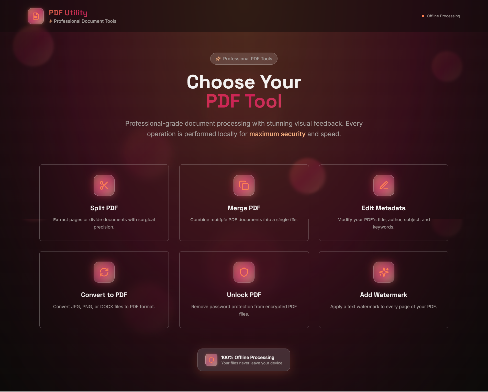

# Offline PDF Utility

An **AI-coded**, completely offline PDF toolkit built with React and TypeScript, featuring a stunning glassmorphism UI. Perform all PDF operations securely in your browser with complete privacy.

## App Interface



## Features

- **100% Offline**: Your files are never uploaded to a server, ensuring maximum privacy and security.
- **Modern UI**: A beautiful and intuitive glassmorphism interface built with the Lovable UI framework.
- **Split PDF**: Extract specific pages or page ranges from a PDF.
- **Merge PDF**: Combine multiple PDF documents into a single file.
- **Unlock PDF**: Remove password protection from encrypted PDF files.
- **Edit Metadata**: Modify your PDF's title, author, subject, and keywords.
- **Convert to PDF**: Convert JPEG, PNG, or DOCX files to PDF format.
- **Add Watermark**: Apply a text watermark to every page of your PDF.

## Technologies

- **React**: A JavaScript library for building user interfaces.
- **TypeScript**: A typed superset of JavaScript that compiles to plain JavaScript.
- **Vite**: A fast and modern build tool for web development.
- **pdf-lib**: A JavaScript library for creating and modifying PDF documents.
- **mammoth.js**: A library for converting .docx files to HTML.
- **html2pdf.js**: A library to generate PDFs from HTML.
- **Lovable UI**: A stunning, modern UI framework.
- **AI-Assisted Development**: Coded with the help of Cascade, an agentic AI coding assistant.

## Setup and Development

1. **Clone the repository:**
   ```bash
   git clone https://github.com/your-username/offline-pdf-utility.git
   cd offline-pdf-utility
   ```

2. **Install dependencies:**
   ```bash
   npm install
   ```

3. **Run the development server:**
   ```bash
   npm run dev
   ```

4. **Open the application:**
   Open your browser and navigate to the local URL provided by Vite (usually `http://localhost:5173`).

## Contribution Guidelines

We welcome contributions! If you have an idea for a new feature or have found a bug, please open an issue to discuss it. Pull requests are also welcome.

## Contact

For any questions or feedback, please reach out via [GitHub Issues](../../issues).
